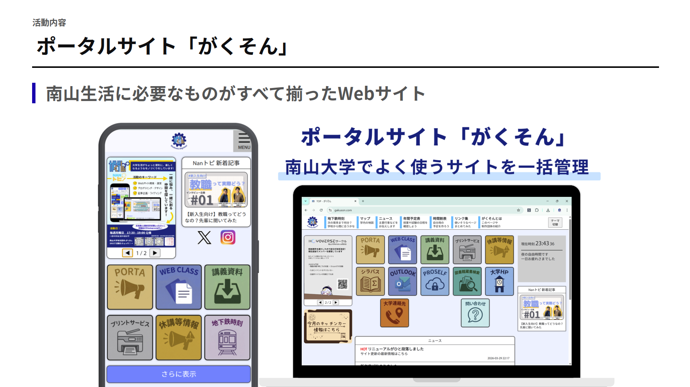
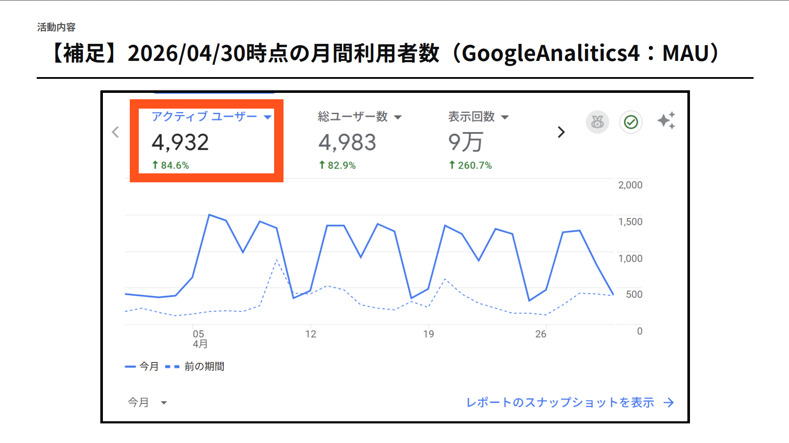

# Gakuson Portal

南山大学生向けに、大学生活で使うリンク・情報・小さな便利機能を集約した、実利用されている学生向けポータルサービスです。

公開サイト: [gakuson.com](https://gakuson.com)



## Problem

南山大学の学生生活では、PORTA、WebClass、講義資料、図書館、休講情報、地下鉄時刻、大学 HP など、日常的に使う情報が複数の場所に分散しています。

学生が毎日使う導線なのに、必要な情報へたどり着くまでの手間が多く、特に新入生やスマートフォン利用時には不便が出やすい状態でした。

## Role

学生団体「がくそん」では、設立当時は副代表、現在は代表として、サービスの企画、開発、改善、運営、組織づくりを担当しています。

実装面では、静的サイトとしての構成、主要ページ、共通 UI、JSON ベースの情報表示、日常利用向けの小機能を整備しました。運営面では、学生ユーザーの使い方を見ながら、発信、改善、広告掲載、学内外との連携まで含めて継続運用しています。

## What I Built

主な機能は以下です。

- よく使う大学システムへの quick link dashboard
- 授業時間の進捗表示
- ニュース・告知を JSON で管理する表示機構
- キャンパスマップと建物ピン表示
- 地下鉄時刻の補助表示
- Cookie を使った簡易時間割
- サークル種別、規模、活動頻度、人数、部費などで絞り込めるサークル検索
- light / dark theme 切り替え
- Apache `.htaccess` を含む静的ホスティング設定

バックエンドや DB を置かず、HTML / CSS / JavaScript / JSON で保守できる形にしたことで、学生団体内で運用しやすい軽量な構成にしています。

## Result

2026年4月30日時点で、GA4 計測の月間アクティブユーザーは 4,932 人、総ユーザー数は 4,983 人、月間表示回数は約 9 万回です。GA4 MAU は 4,500 から 5,000 人規模です。

2024年7月時点では月間利用者数約 1,800 人でしたが、2025年12月に約 3,500 人、2026年4月に約 4,900 人規模まで成長しました。単なる制作物ではなく、南山大学生が日常的に使う学内向けサービスとして運営しています。

現代表としては、Web サービスの開発だけでなく、運営チーム・開発チームの役割設計、広告掲載、企業協賛、大学支援を含めて、継続可能な学生組織に育てることにも取り組んでいます。

## Tech Stack

- HTML5
- CSS3
- Vanilla JavaScript
- JSON
- Browser Cookie
- Apache `.htaccess`
- Static hosting

## Project Structure

```text
.
|-- index.html                 # トップページと quick link dashboard
|-- about.html                 # サービス・団体紹介
|-- allLinks.html              # 追加リンク集
|-- calendar.html              # 年間予定表
|-- classesTable.html          # Cookie 保存の簡易時間割
|-- circleSearch.html          # サークル検索ページ
|-- map.html                   # キャンパスマップ
|-- news.html                  # ニュース一覧
|-- next-subway.html           # 地下鉄発車時刻の補助表示
|-- header.html / footer.html  # 共通 UI
|-- style.css                  # 共通スタイル
|-- circleSearch.css           # サークル検索用スタイル
|-- classProgress.js           # 授業時間の進捗表示
|-- circleSearch.js            # サークル検索の絞り込み・並べ替え
|-- indexCarousel.js           # トップページのカルーセル表示
|-- newsLoader.js              # ニュース表示
|-- next-subway.js             # 地下鉄時刻表ロジック
|-- theme.js                   # theme 切り替え
|-- newsData.json              # ニュースデータ
|-- circleList.json              # サークル検索データ
|-- mapAssets/                 # 地図画像と建物データ
|-- subwayTimetable/           # 地下鉄時刻表 JSON
|-- img/                       # 画像素材
|-- icon/                      # quick link などのアイコン
|-- errorPage/                 # 403 / 404 ページ
|-- .htaccess                  # Apache hosting 設定
|-- generate.sh                # sitemap 生成補助
```

## Local Preview

共通 header / footer や JSON を `fetch()` で読み込み、`/header.html` のような root-relative path も使うため、ファイルを直接開くのではなく、repository root から HTTP server で確認します。

```powershell
cd C:\Users\yuuki\Documents\programming\GakusonPortal
python -m http.server 8000
```

その後、次の URL を開きます。

```text
http://localhost:8000/
```

## Maintenance Notes

- ニュースは `newsData.json` を更新する。
- サークル検索データは `circleList.json` を更新する。
- キャンパスマップのピンは `mapAssets/nodes.json` を更新する。
- 地下鉄時刻表は `subwayTimetable/` 配下の JSON を更新する。
- sitemap を更新する必要がある場合は、Unix-like shell で `generate.sh` を実行する。
- 問い合わせ先、SNS、告知、協賛表示などの公開情報は、がくそんの運営判断と一致させる。

## Evidence

- Public service: [gakuson.com](https://gakuson.com)
- GitHub repository: [Gakuson/GakusonPortal](https://github.com/Gakuson/GakusonPortal)
- GA4 計測値: 2026年4月30日時点のスクリーンショットに基づく。月間アクティブユーザー 4,932 人、総ユーザー数 4,983 人、月間表示回数 約 9 万回。
- 学生団体概要資料: ローカル資料 `学生団体.md` を根拠に作成



## Links

- [Gakuson Portal](https://gakuson.com)
- [GitHub repository](https://github.com/Gakuson/GakusonPortal)
